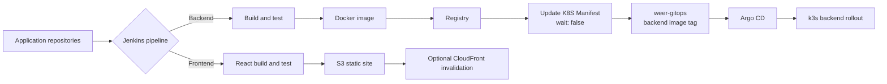

# WeER Pipeline

言語: [한국어](README.ko.md) | [English](README.md) | 日本語

WeER Pipeline は、WeER Renewal ポートフォリオプロジェクトの Jenkins CI リポジトリです。既存の Jenkins ベースのデリバリーフローを、アプリケーションの実際のデプロイ単位に合わせて二つの経路に整理しています。

- Backend: アプリケーションのビルドとテスト、Docker イメージの作成・レジストリへの push、GitOps への更新連携
- Frontend: React のビルド、S3 への静的ファイルの upload、必要に応じた CloudFront invalidation

## この境界を選んだ理由

Backend は Kubernetes ワークロードとして動作するため、Git にある宣言的なイメージ状態を変更するリリース方法が適しています。一方、Frontend は現在静的サイトとして配信するため、React の build 結果を S3 に upload する方がシンプルです。そのため、実際には使用しない Frontend の Helm リソースを `weer-gitops` に置いていません。

これはすべての環境に適用する唯一の正解ではなく、今回の MVP に対する設計判断です。将来、ランタイム要件やルーティング要件が変われば、Frontend を Kubernetes ワークロードに移すことも再検討します。

## Pipeline と GitOps の接続



Backend の downstream job には、サービス名、イメージリポジトリ、タグと digest、source commit、upstream build URL を渡します。Job は `weer-gitops` の `charts/weer/values-local.yaml` を更新し、Argo CD がその Git の変更を k3s に反映します。`wait: false` により、アプリケーションの build が GitOps 同期の所要時間に依存しません。その代わり、運用環境では downstream の状態とアラートを別に追跡する必要があります。

## 設計上の意見と判断

1. Shared Library は繰り返し使う実行ロジックをまとめますが、Pipeline の重要な判断まで隠さない方針です。Checkout、アプリケーション build、Docker push、静的サイト upload、GitOps 連携、メタデータ記録は、責任と失敗の扱いが異なるため分けています。
2. Backend のイメージ公開と Kubernetes デプロイをステージとリポジトリで分離しました。デプロイ変更を Git で確認でき、Argo CD がクラスターの reconciler になります。
3. Frontend の実際の配信先が S3 であるため、Docker と Helm を必須の経路にしていません。
4. InfluxDB などの履歴データベースは次の候補です。MVP ではまず `pipeline-metadata.json` をアーティファクトとして保存し、後で認証、保持期間、重複イベント処理を考慮した履歴サービスへ拡張します。

## リポジトリ構成

```text
.
├── jenkinsfiles/
│   ├── jenkinsfile.backend
│   ├── jenkinsfile.frontend
│   └── jenkinsfile.update-k8s-manifest
├── shared-library-system/vars/
├── docs/
└── examples/
```

このリポジトリは Jenkins Pipeline と GitOps 連携の契約を管理します。Helm chart、Argo CD Application、k3s のデプロイ状態、Terraform/AWS 設計、監視設定は `weer-gitops` と今後のインフラドキュメントの範囲です。

## 次に検証すること

実際の Jenkins credential と tool 設定を接続し、Backend Dockerfile の build、ローカル k3s/Argo CD デプロイ、downstream 失敗、rollout と rollback の結果を確認します。実際の credential や private endpoint は含めていません。
