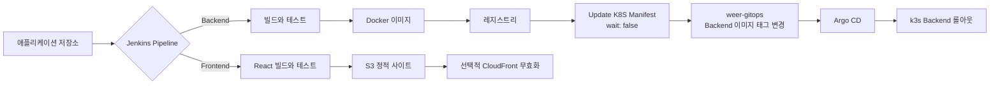

# WeER Pipeline

언어: 한국어 | [English](README.md) | [日本語](README.ja.md)

WeER Pipeline은 WeER Renewal 포트폴리오 프로젝트의 Jenkins CI 저장소다. 기존 Jenkins 기반 배포 흐름을 두 가지 배포 경로로 나누어, 각 애플리케이션의 실제 배포 단위에 맞게 정리했다.

- Backend: 애플리케이션 빌드와 테스트, Docker 이미지 생성 및 레지스트리 업로드, GitOps 업데이트 전달
- Frontend: React 빌드 후 S3 업로드, 필요할 때 CloudFront 캐시 무효화

## 왜 이렇게 나눴나

Backend는 Kubernetes에서 실행되는 워크로드이므로, 릴리스 시 Git에 선언된 이미지 상태를 바꾸는 방식이 잘 맞는다. 반면 Frontend는 현재 정적 사이트로 배포하므로 React 빌드 결과물을 S3에 올리는 흐름이 더 단순하다. 그래서 실제로 사용하지 않는 Frontend Helm 리소스를 `weer-gitops`에 남겨두지 않았다.

이 결정은 모든 환경에 적용되는 정답이 아니라 이번 MVP의 배포 모델에 대한 판단이다. 운영 요구사항이나 라우팅 구조가 바뀌면 Frontend를 Kubernetes 워크로드로 옮기는 선택도 다시 검토할 수 있다.

## Pipeline과 GitOps 연결



Backend downstream job에는 서비스명, 이미지 저장소, 이미지 태그와 digest, 소스 커밋, upstream build URL을 전달한다. Job은 `weer-gitops`의 `charts/weer/values-local.yaml`을 변경하고, Argo CD가 그 Git 변경을 k3s에 반영한다. `wait: false`는 애플리케이션 빌드가 GitOps 동기화 시간에 묶이지 않게 해준다. 대신 운영 환경에서는 downstream 상태와 알림을 별도로 추적해야 한다.

## 설계 과정에서의 의견

1. Shared Library는 반복되는 실행 로직을 줄이되, Pipeline의 중요한 판단까지 숨기지는 않도록 했다. Checkout, 애플리케이션 빌드, Docker 업로드, 정적 사이트 업로드, GitOps 전달, 메타데이터 기록은 실패 지점과 책임이 달라 별도 단계로 유지했다.
2. Backend 이미지 업로드와 Kubernetes 배포를 단계와 저장소로 분리했다. 덕분에 배포 변경이 Git에서 확인 가능하고, Argo CD가 클러스터의 reconciler 역할을 맡는다.
3. 현재 S3가 Frontend의 실제 배포 대상이므로 Docker와 Helm을 억지로 거치지 않는다.
4. InfluxDB 같은 이력 저장소는 유용한 다음 단계지만, MVP에서는 우선 `pipeline-metadata.json`을 아티팩트로 보존한다. 이후에는 같은 스키마를 인증, 보존 기간, 중복 이벤트 처리까지 고려한 이력 서비스로 전송할 수 있다.

## 저장소 구조

```text
.
├── jenkinsfiles/
│   ├── jenkinsfile.backend
│   ├── jenkinsfile.frontend
│   └── jenkinsfile.update-k8s-manifest
├── shared-library-system/vars/
├── docs/
└── examples/
```

이 저장소는 Jenkins Pipeline과 GitOps 전달 계약을 관리한다. Helm chart, Argo CD Application, k3s 배포 상태, Terraform/AWS 설계, 모니터링 구성은 `weer-gitops`와 후속 인프라 문서의 범위다.

## 다음 검증

실제 Jenkins credential과 도구 설정을 연결하고, Backend Dockerfile 빌드, 로컬 k3s/Argo CD 배포, downstream 실패, 롤아웃과 롤백 결과를 확인해야 한다. 이 저장소에는 실제 credential이나 사설 endpoint를 포함하지 않는다.
