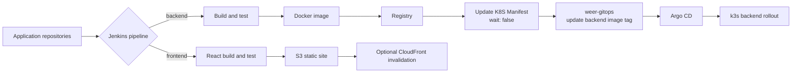

# WeER Pipeline

Language: [한국어](README.ko.md) | English | [日本語](README.ja.md)

WeER Pipeline is the Jenkins CI repository for the WeER Renewal portfolio project. It demonstrates how an existing Jenkins-based delivery process can be reorganized into two explicit delivery paths:

- Backend: build and test the application, create and publish a Docker image, then hand off immutable image metadata to GitOps.
- Frontend: build the React application and publish the static artifact to S3, with optional CloudFront invalidation.

## Why This Boundary?

The two applications have different deployment units. The backend is a Kubernetes workload, so its release should change declarative image state in Git. The frontend is a static site, so a React build followed by S3 delivery is a smaller and more direct deployment path for this MVP. Keeping frontend Helm resources out of `weer-gitops` avoids representing a deployment model that is not actually used.

This is a deliberate design choice, not a claim that one model is universally best. A future decision may move the frontend to Kubernetes if runtime requirements, edge routing, or operational consistency justify it.

## End-to-End Connection



The downstream job receives `SERVICE_NAME`, image repository, image tag, image digest, source commit, and the upstream build URL. It updates `charts/weer/values-local.yaml` in `weer-gitops`; Argo CD then reconciles the Git change into k3s. `wait: false` keeps the application build independent from the asynchronous GitOps reconciliation. The trade-off is that the upstream job must expose downstream status and alerts clearly.

## Design Discussion

Several implementation opinions shaped this repository:

1. Shared Library should remove repeated operational logic, but not hide every pipeline decision. The current library keeps checkout, application build, Docker publishing, static-site publishing, GitOps handoff, metadata recording, and manifest update as separate steps because they have different ownership and failure semantics.
2. Backend image publication and Kubernetes deployment should be separate stages and repositories. This gives GitOps a reviewable, auditable deployment change and allows Argo CD to be the cluster reconciler.
3. The frontend should not be forced through Docker and Helm when its current delivery target is S3. Its pipeline records the static-site target instead.
4. InfluxDB or another history database is a useful next step, but the MVP first archives `pipeline-metadata.json`. A production implementation should send the same schema to a managed history service with retention, authentication, and duplicate-event handling.

## Repository Layout

```text
.
├── jenkinsfiles/
│   ├── jenkinsfile.backend
│   ├── jenkinsfile.frontend
│   └── jenkinsfile.update-k8s-manifest
├── shared-library-system/vars/
│   ├── buildApplication.groovy
│   ├── checkoutSource.groovy
│   ├── publishDockerImage.groovy
│   ├── publishStaticSite.groovy
│   ├── recordPipelineMetadata.groovy
│   ├── triggerGitOpsUpdate.groovy
│   └── updateGitOpsManifest.groovy
├── docs/
└── examples/
```

## Scope and Next Verification

This repository owns Jenkins pipeline definitions and the handoff contract. `weer-gitops` owns Helm, Argo CD, k3s deployment state, and rollback documentation. Terraform/AWS reference architecture and monitoring are future portfolio layers.

Before calling this production-ready, verify Jenkins credentials and tools, build the real backend Dockerfile, run a local k3s/Argo CD deployment, test a failed downstream update, and confirm rollout/rollback evidence. No real credentials or private endpoints are included here.
